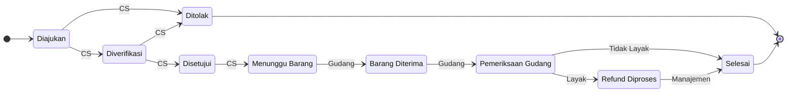
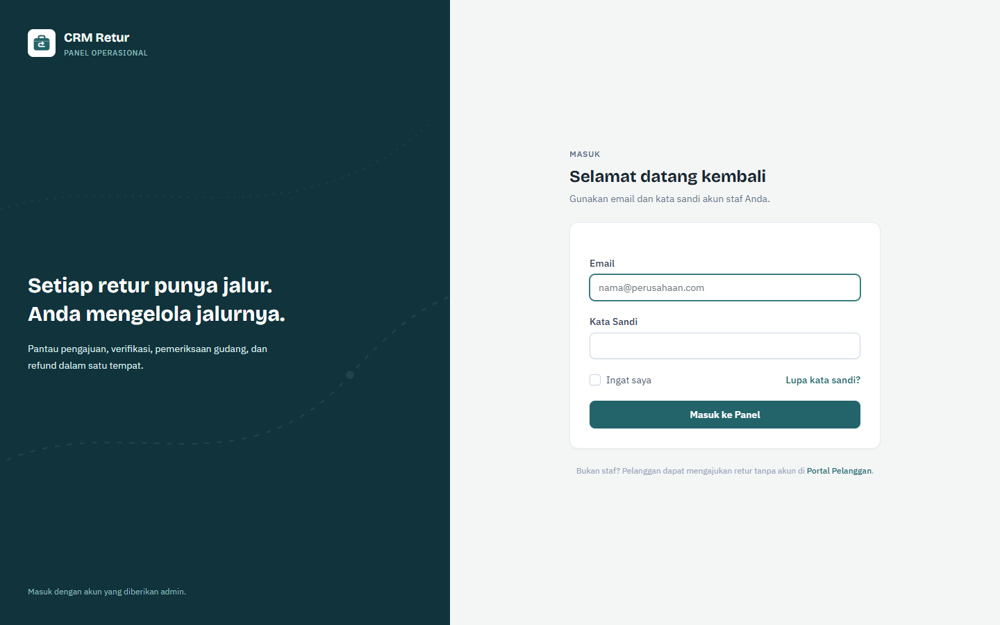
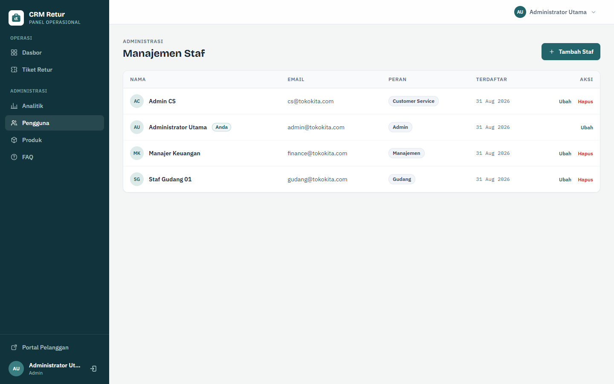

<p align="center">
  
</p>

<h1 align="center">CRM Retur</h1>

<p align="center">
  <strong>Sistem manajemen retur &amp; refund (RMA) siap integrasi untuk toko online.</strong><br>
  Pelanggan mengajukan dan melacak pengembalian tanpa membuat akun, tim Anda memprosesnya dari satu dasbor.
</p>

<p align="center">
  
  
  
  
</p>

---

## Tentang Proyek

**CRM Retur** adalah platform *Return Merchandise Authorization* (RMA) mandiri yang menangani seluruh siklus pengembalian barang — mulai dari pengajuan pelanggan, verifikasi, penerimaan gudang, hingga refund — dalam satu aplikasi.

Aplikasi ini **dirancang untuk berjalan berdampingan dengan toko online yang sudah ada** (toko kustom, WooCommerce, atau marketplace self-hosted). Portal pelanggannya bersifat publik tanpa login, sehingga Anda cukup menautkannya dari halaman pesanan atau menu bantuan toko — tanpa memaksa pelanggan membuat akun baru.

> CRM Retur dibangun ulang dari sistem PHP prosedural lama menjadi arsitektur Laravel yang modern, teruji (122 pengujian fitur), dan aman.

### Mengapa CRM Retur

- **Tanpa akun untuk pelanggan.** Pengajuan dan pelacakan cukup berbekal nomor retur.
- **Portal publik yang bisa ditautkan** dari sistem pesanan toko mana pun.
- **Alur kerja (state machine) yang ketat.** Setiap perpindahan status divalidasi per peran dan tercatat di riwayat.
- **Transparan bagi pelanggan.** Setiap perubahan status memicu notifikasi email dan terlihat di halaman lacak.

## Fitur Utama

**Portal Pelanggan (publik)**

- Formulir pengajuan retur dengan unggah bukti foto/video (gambar maks. 5 MB, video maks. 50 MB).
- Nomor tiket otomatis berformat `RET-YYYYMMDD-XXXX`.
- Pelacakan status berdasarkan nomor retur — tanpa login.
- Live chat dengan staf langsung dari halaman lacak (aman berbasis token).
- FAQ yang dikelola dari panel admin.

**Dasbor & Alur Kerja Staf**

- Antrean kerja dengan filter dan pencarian, disesuaikan per peran.
- Transisi status terpusat melalui `TicketWorkflow` — satu-satunya jalur sah mengubah status.
- Riwayat status lengkap (siapa, kapan, dari–ke status mana, beserta catatan).
- Catatan internal staf yang disembunyikan dari pelanggan.
- Vonis kondisi barang oleh gudang (Layak / Tidak Layak).

**Komunikasi & Notifikasi**

- Live chat pelanggan ↔ staf berbasis polling JSON.
- Email otomatis: konfirmasi pengajuan, pembaruan status, penolakan, dan refund selesai.

**Panel Admin & Analitik**

- Manajemen pengguna, produk, dan FAQ.
- Dasbor analitik dengan Chart.js (volume tiket, distribusi status, produk & alasan retur terbanyak).

## Cara Kerja (Alur Tiket)

Setiap tiket bergerak melalui state machine berikut. Peran yang berwenang ditandai pada tiap panah; **Admin** dapat melakukan semua transisi.



| Peran | Tanggung jawab utama |
|---|---|
| **Customer Service** | Memverifikasi, menyetujui/menolak, mengawal tiket hingga barang dikirim balik oleh pelanggan, dan mengelola FAQ. |
| **Gudang** | Menerima barang, memeriksa kondisi, memberi vonis Layak / Tidak Layak. |
| **Manajemen** | Memproses dan menyelesaikan refund. |
| **Admin** | Akses penuh: pengguna, produk, FAQ, dan seluruh transisi tiket. |

## Tangkapan Layar

| Portal pelanggan | |
|---|---|
| Landing page & pelacakan | Formulir pengajuan |
|  |  |
| Halaman lacak + live chat | Login staf |
|  |  |

| Dasbor internal | |
|---|---|
| Dasbor staf | Detail tiket + alur kerja |
|  |  |
| Analitik | Manajemen pengguna |
|  |  |

## Integrasi dengan Toko Online Anda

CRM Retur dirancang sebagai **layanan pendamping** toko online yang sudah ada, bukan pengganti. Pola integrasi yang didukung saat ini:

### 1. Tautkan dari halaman pesanan toko Anda

Setiap tiket memiliki nomor unik `RET-YYYYMMDD-XXXX`. Dari halaman riwayat pesanan atau email konfirmasi toko, arahkan pelanggan ke halaman lacak:

```
https://retur.tokosaya.com/lacak/RET-20260830-0015
```

Tidak ada sesi atau akun toko yang dibutuhkan — halaman lacak bersifat publik.

### 2. Hubungkan tiket dengan pesanan toko

Formulir pengajuan menyediakan kolom **Nomor Invoice** (`invoice_number`) yang bebas diisi nomor pesanan/invoice dari sistem toko Anda. Staf dapat mencocokkan pengajuan dengan transaksi asal; kolom ini menjadi "jembatan" utama antara CRM Retur dan sistem pesanan Anda.

### 3. Sinkronkan katalog produk

Daftar produk yang dapat diretur dikelola di **Admin → Produk** (`products`). Isi sesuai katalog toko Anda (nama, SKU, harga). Hanya produk aktif yang muncul di formulir pengajuan pelanggan.

### 4. Gunakan endpoint JSON live chat

Widget chat portal berkomunikasi lewat endpoint JSON sederhana yang juga dapat dipakai frontend toko Anda sendiri:

| Endpoint | Metode | Keterangan |
|---|---|---|
| `/chat/{ticket}/messages?after_id={id}` | GET | Ambil pesan baru (polling). Pelanggan menyertakan `token`. |
| `/chat/{ticket}/message` | POST | Kirim pesan. Pelanggan menyertakan `token`. |
| `/chat/ping` | GET | Health-check endpoint. |

Setiap tiket membawa `tracking_token` acak yang menjadi kredensial pelanggan tanpa login — hanya pemegang token yang dapat mengakses chat tiket tersebut.

### 5. Branding sesuai toko Anda

- `APP_NAME` di `.env` mengubah nama aplikasi di seluruh antarmuka dan email.
- Warna merek terpusat di `tailwind.config.js` (palet `brand` petrol-teal, mudah diganti palet toko Anda).
- Seluruh teks portal berada di `resources/views/portal/**` dan dapat disesuaikan.

### Pola deployment yang disarankan

```
tokosaya.com            → toko online Anda (tetap)
retur.tokosaya.com      → CRM Retur (subdomain, deployment terpisah)
```

Atau pasang di path `/retur` di belakang reverse proxy (Nginx/Caddy). Memisahkan aplikasi dari toko membuat pembaruan salah satu tidak mengganggu yang lain.

### Roadmap integrasi

- **REST API publik** (`POST /api/tickets`, `GET /api/tickets/{number}`) dengan API key agar toko dapat membuat & membaca tiket secara programatis.
- **Webhook status** — panggilan balik ke toko setiap tiket berpindah status.
- **Prefill formulir** — buka `/ajukan-retur?produk=&invoice=` langsung dari halaman pesanan.
- **Sinkronisasi katalog otomatis** dari API toko.

## Teknologi

| Lapisan | Teknologi |
|---|---|
| Backend | PHP ≥ 8.2, Laravel 12, Laravel Breeze (Blade) |
| Frontend | Tailwind CSS 3, Alpine.js, Chart.js |
| Basis data | MySQL / MariaDB (SQLite untuk pengujian) |
| Antrean & email | Laravel Queue + Mailer (SMTP, log, dsb.) |
| Pengujian | PHPUnit — 127 pengujian fitur, 494 assertion |

## Persyaratan

- PHP ≥ 8.2 (ekstensi: `pdo_mysql`, `mbstring`, `openssl`, `fileinfo`)
- Composer 2
- Node.js ≥ 18 & npm
- MySQL 8 / MariaDB 10.6+
- Web server (Nginx/Apache) atau `php artisan serve` untuk pengembangan

## Instalasi

```bash
# 1. Ambil kode
git clone https://github.com/Chaerulcp/projek-crm-retur.git
cd projek-crm-retur

# 2. Pasang dependensi
composer install
npm install

# 3. Konfigurasi lingkungan
cp .env.example .env        # Windows: copy .env.example .env
php artisan key:generate

# 4. Siapkan basis data (buat database `crm_retur` terlebih dahulu)
php artisan migrate --seed

# 5. Tautkan penyimpanan publik & bangun aset
php artisan storage:link
npm run build

# 6. Jalankan
php artisan serve           # → http://localhost:8000
```

Untuk pengembangan aktif (server + queue + log + Vite dalam satu perintah):

```bash
composer run dev
```

> Seed demo membuat 4 staf, 5 produk, 6 FAQ, dan 14 tiket contoh. Lewati `--seed` bila langsung dipakai produksi, atau bersihkan data demo setelahnya.

## Konfigurasi

Variabel `.env` yang paling relevan:

| Variabel | Keterangan | Contoh |
|---|---|---|
| `APP_NAME` | Nama aplikasi di antarmuka & email. | `"Toko Kita"` |
| `APP_URL` | URL publik aplikasi (penting untuk tautan email). | `https://retur.tokosaya.com` |
| `DB_CONNECTION`, `DB_HOST`, `DB_DATABASE`, … | Koneksi basis data. | `mysql`, `127.0.0.1`, `crm_retur` |
| `MAIL_MAILER`, `MAIL_HOST`, `MAIL_PORT`, … | Pengiriman email notifikasi. | `smtp`, `127.0.0.1`, `1025` |
| `QUEUE_CONNECTION` | Driver antrean untuk email & notifikasi. | `database` |
| `RECAPTCHA_SITEKEY`, `RECAPTCHA_SECRET` | Google reCAPTCHA v2 pada form pengajuan retur. Kosongkan untuk menonaktifkan CAPTCHA. | `6Lc…` |

> Di pengembangan, `MAIL_MAILER=log` menulis email ke `storage/logs/laravel.log` alih-alih mengirimnya.

## Pengujian

Seluruh alur kritis — portal publik, state machine per peran, chat, dan admin — tercakup pengujian fitur:

```bash
php artisan test
```

Hasil saat ini: **122 pengujian lulus (473 assertion)** dengan SQLite in-memory, tanpa butuh basis data lokal.

## Akun Demo

Seeder membuat empat akun staf berikut:

| Peran | Email | Kata sandi |
|---|---|---|
| Admin | `admin@tokokita.com` | `adminpassword123` |
| Customer Service | `cs@tokokita.com` | `cs12345` |
| Gudang | `gudang@tokokita.com` | `gudang123` |
| Manajemen | `finance@tokokita.com` | `finance123` |

> Ganti seluruh kata sandi ini sebelum deploy produksi.

## Struktur Proyek

```
app/
├── Enums/            # Role, TicketStatus, ItemCondition, SenderType
├── Events/           # TicketStatusChanged
├── Http/
│   ├── Controllers/  # Portal/, Staff/, Admin/, Chat/, Auth/
│   ├── Middleware/   # EnsureUserHasRole (alias 'role:')
│   └── Requests/     # FormRequest per modul
├── Listeners/        # SendTicketStatusNotification (email otomatis)
├── Mail/             # Mailable: pengajuan, status, penolakan, refund
├── Models/           # ReturnTicket, Customer, Product, ChatMessage, …
└── Services/
    ├── TicketWorkflow.php        # State machine terpusat
    └── TicketNumberGenerator.php # Format RET-YYYYMMDD-XXXX
routes/
├── portal.php        # Portal pelanggan publik (tanpa login)
├── staff.php         # Dasbor & alur kerja staf
├── admin.php         # Panel admin & analitik
└── chat.php          # Endpoint JSON live chat
resources/views/
├── portal/           # Halaman publik pelanggan
├── staff/            # Dasbor internal
├── admin/            # Panel admin
└── chat/             # Widget live chat
```

## Catatan Keamanan

- Portal publik hanya mengekspos data tiket berdasarkan nomor tiket; chat additionally dilindungi `tracking_token` per tiket.
- Perubahan status hanya mungkin lewat `TicketWorkflow` dengan validasi peran, dibungkus transaksi basis data.
- Catatan internal staf tidak pernah ditampilkan di halaman pelanggan.
- Unggahan bukti divalidasi tipe & ukurannya, disimpan di luar webroot (disk `public` via `storage:link`).

## Kontribusi

Kontribusi terbuka melalui pull request:

1. Fork repositori ini dan buat branch fitur (`git checkout -b feature/xyz`).
2. Jalankan `php artisan test` dan pastikan seluruh pengujian lulus.
3. Jaga konsistensi gaya kode (`vendor/bin/pint` tersedia sebagai formatter).
4. Ajukan pull request dengan deskripsi perubahan yang jelas.

## Lisensi

CRM Retur dirilis di bawah [Lisensi MIT](LICENSE).

