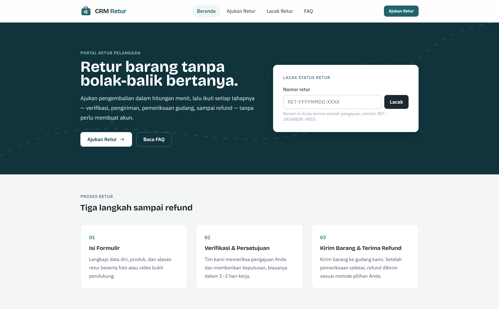
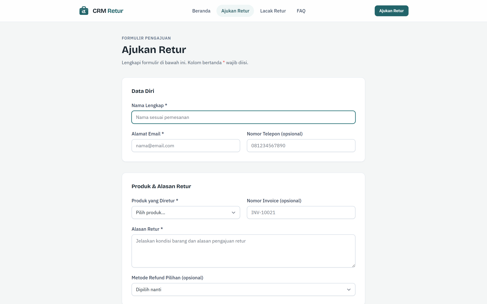
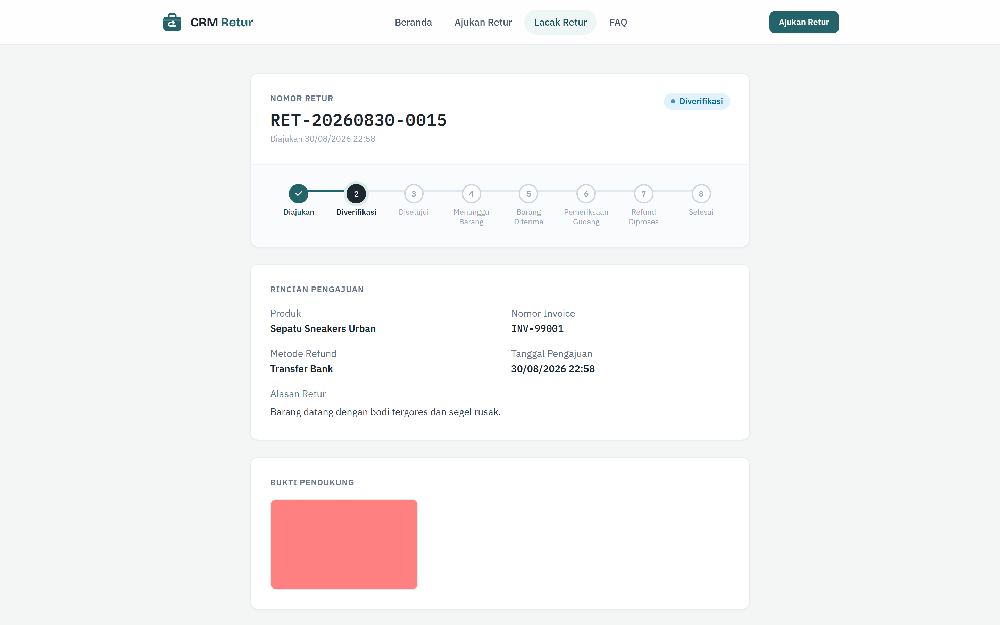
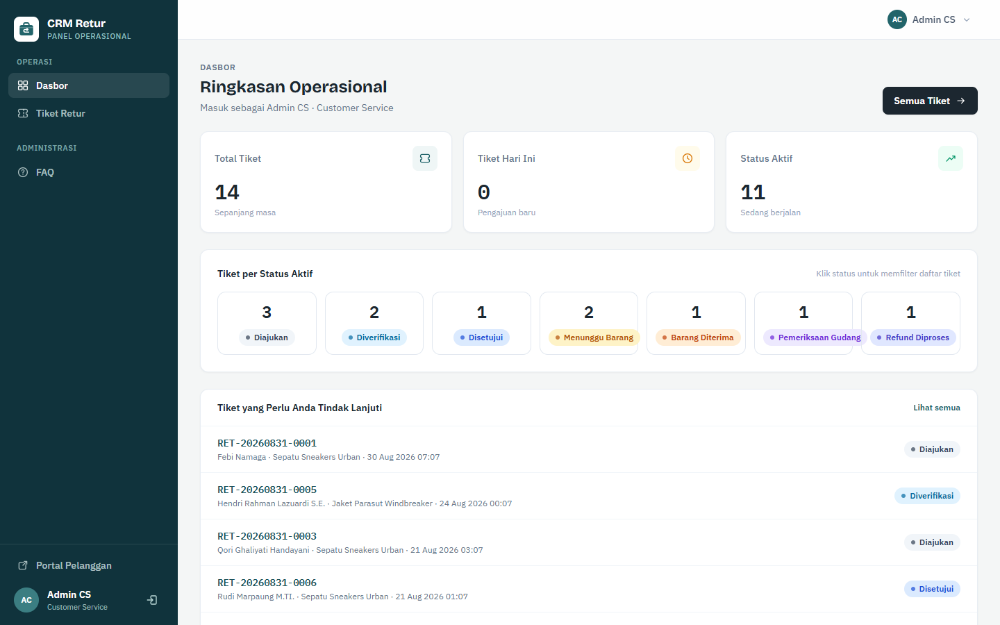
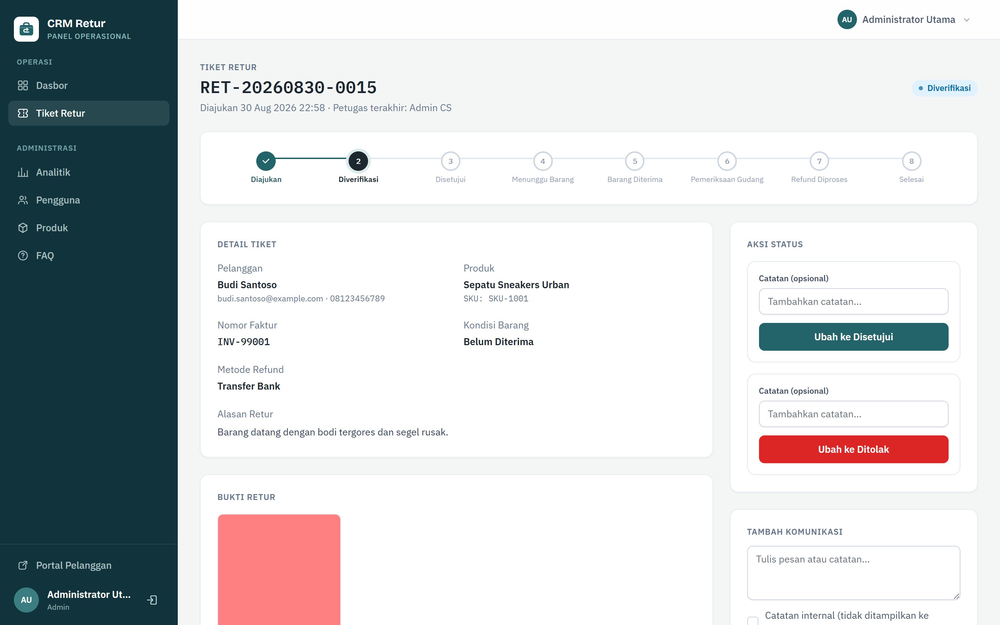
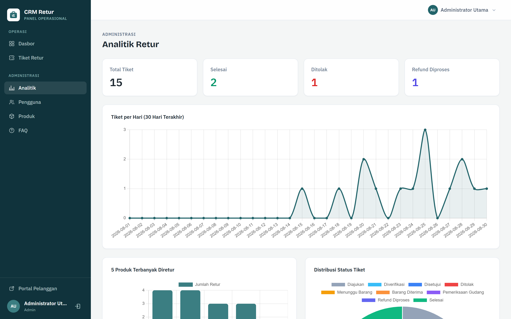
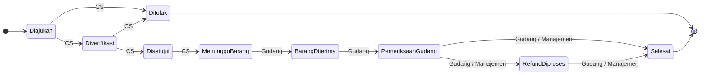

<p align="center">
  
</p>

<h1 align="center">CRM Retur</h1>

<p align="center">
  Sistem manajemen retur dan refund (RMA) berbasis Laravel 12 untuk toko online.
</p>

<p align="center">
  
  
  
  
</p>

---

## Tentang

CRM Retur menangani siklus pengembalian barang dari pengajuan pelanggan, verifikasi, penerimaan gudang, hingga refund dalam satu aplikasi. Dirancang untuk berjalan berdampingan dengan toko online yang sudah ada — portal pelanggannya bersifat publik tanpa login, cukup ditautkan dari halaman pesanan atau menu bantuan toko.

Proyek ini dibangun ulang dari sistem PHP prosedural lama menjadi arsitektur Laravel modern dengan 127 pengujian fitur (494 assertion).

Karakteristik utama:

- Pelanggan mengajukan dan melacak retur tanpa membuat akun, cukup berbekal nomor tiket.
- Portal publik bisa ditautkan dari sistem pesanan toko mana pun.
- Setiap perpindahan status divalidasi per peran melalui state machine terpusat (`TicketWorkflow`).
- Setiap perubahan status memicu notifikasi email dan tercatat di riwayat tiket.

## Fitur

**Portal Pelanggan (publik, tanpa login)**

- Formulir pengajuan retur dengan unggah bukti foto (maks. 5 MB) dan video (maks. 50 MB).
- Nomor tiket otomatis berformat `RET-YYYYMMDD-XXXX`.
- Halaman pelacakan status berdasarkan nomor tiket.
- Live chat dengan staf dari halaman lacak (diamankan dengan `tracking_token` per tiket).
- Halaman FAQ yang dikelola dari panel admin.
- Perlindungan reCAPTCHA v2 opsional pada formulir pengajuan (aktif bila variabel env diisi).

**Dasbor dan Alur Kerja Staf**

- Antrean tiket dengan filter, pencarian, dan tampilan disesuaikan per peran.
- Transisi status terpusat melalui `TicketWorkflow` — satu jalur sah mengubah status tiket.
- Riwayat status lengkap: siapa, kapan, dari mana ke mana, beserta catatan.
- Catatan internal staf yang tidak terlihat oleh pelanggan.
- Vonis kondisi barang oleh gudang (Layak / Tidak Layak).

**Komunikasi dan Notifikasi**

- Live chat pelanggan-staf berbasis polling JSON.
- Email otomatis saat: konfirmasi pengajuan, pembaruan status, penolakan, dan refund selesai.

**Panel Admin dan Analitik**

- Manajemen pengguna, produk, dan FAQ.
- Dasbor analitik dengan Chart.js — volume tiket, distribusi status, produk dan alasan retur terbanyak.

## Screenshot

| Portal Pelanggan | Formulir Pengajuan |
|---|---|
|  |  |

| Pelacakan Tiket | Dasbor Staf |
|---|---|
|  |  |

| Detail Tiket (Staf) | Analitik Admin |
|---|---|
|  |  |

## Alur Tiket

Setiap tiket bergerak melalui state machine berikut. Peran yang berwenang ditandai pada tiap panah; Admin dapat melakukan semua transisi.



9 status · 4 peran (Admin, Customer Service, Gudang, Manajemen) · setiap transisi tercatat di `ticket_status_histories`.

## Prasyarat

- PHP >= 8.2 dengan ekstensi `pdo_sqlite` (untuk pengembangan) atau `pdo_mysql` / `pdo_pgsql`
- Composer >= 2.x
- Node.js >= 18 dan npm
- SQLite (default, tanpa konfigurasi) atau MySQL / PostgreSQL


## Instalasi

```bash
# 1. Clone repositori
git clone https://github.com/Chaerulcp/crm-retur.git
cd crm-retur

# 2. Setup otomatis (install dependensi, generate key, migrasi, build frontend)
composer setup

# 3. Isi data demo (opsional)
php artisan db:seed

# 4. Jalankan semua service pengembangan sekaligus
composer dev
```

`composer dev` menjalankan empat proses bersamaan:
- `php artisan serve` — server aplikasi di `http://localhost:8000`
- `php artisan queue:listen` — worker antrean email dan notifikasi
- `php artisan pail` — streaming log real-time
- `npm run dev` — Vite dev server (hot reload)

Alternatif manual:

```bash
composer install
cp .env.example .env
php artisan key:generate
touch database/database.sqlite
php artisan migrate
npm install && npm run build
php artisan serve
```

## Konfigurasi

Variabel penting di `.env`:

| Variabel | Keterangan | Contoh |
|---|---|---|
| `APP_NAME` | Nama aplikasi di antarmuka dan email | `"Toko Kita"` |
| `APP_URL` | URL publik, digunakan untuk tautan di email | `https://retur.tokosaya.com` |
| `DB_CONNECTION` | Driver database (`sqlite`, `mysql`, `pgsql`) | `sqlite` |
| `MAIL_MAILER` | Driver pengiriman email | `smtp` |
| `QUEUE_CONNECTION` | Driver antrean untuk email dan notifikasi | `database` |
| `RECAPTCHA_SITEKEY` | Google reCAPTCHA v2 site key (kosongkan untuk nonaktif) | — |
| `RECAPTCHA_SECRET` | Google reCAPTCHA v2 secret key | — |

Di pengembangan, `MAIL_MAILER=log` menulis email ke `storage/logs/laravel.log` alih-alih mengirimnya.


## Pengujian

Seluruh alur kritis tercakup pengujian fitur yang berjalan dengan SQLite in-memory, tanpa memerlukan database terpisah:

```bash
php artisan test
```

Hasil saat ini: 127 pengujian lulus (494 assertion).

Cakupan pengujian meliputi: portal publik (pengajuan, pelacakan, notifikasi), state machine per peran, live chat, CRUD admin (pengguna, produk, FAQ), analitik, dan autentikasi.

## Akun Demo

Seeder (`php artisan db:seed`) membuat empat akun staf:

| Peran | Email | Password |
|---|---|---|
| Admin | `admin@tokokita.com` | `adminpassword123` |
| Customer Service | `cs@tokokita.com` | `cs12345` |
| Gudang | `gudang@tokokita.com` | `gudang123` |
| Manajemen | `finance@tokokita.com` | `finance123` |

Ganti seluruh password ini sebelum deploy ke produksi.

## Struktur Proyek

```
app/
├── Enums/            # Role, TicketStatus, ItemCondition, SenderType
├── Events/           # TicketStatusChanged
├── Http/Controllers/
│   ├── Admin/        # Manajemen pengguna, produk, FAQ, analitik
│   ├── Chat/         # Endpoint JSON live chat
│   ├── Portal/       # Portal publik pelanggan
│   └── Staff/        # Dasbor dan alur kerja staf
├── Listeners/        # SendTicketStatusNotification (email otomatis)
├── Mail/             # Mailable: pengajuan, status, penolakan, refund
├── Models/           # ReturnTicket, Customer, Product, ChatMessage, …
├── Rules/            # Aturan validasi kustom (mis. RecaptchaVerified)
└── Services/
    ├── TicketWorkflow.php        # State machine terpusat
    └── TicketNumberGenerator.php # Format RET-YYYYMMDD-XXXX
routes/
├── portal.php        # Portal pelanggan publik (tanpa login)
├── staff.php         # Dasbor dan alur kerja staf
├── admin.php         # Panel admin dan analitik
├── chat.php          # Endpoint JSON live chat
└── auth.php          # Autentikasi (Laravel Breeze)
database/
├── migrations/       # 12 migrasi
└── seeders/          # UserSeeder, ProductSeeder, FaqSeeder, DemoTicketSeeder
tests/Feature/
├── Admin/            # 5 test file
├── Auth/             # 5 test file
├── Chat/             # 2 test file
├── Portal/           # 4 test file
└── Staff/            # 6 test file
```


## Keamanan

- Portal publik hanya mengekspos data tiket berdasarkan nomor tiket; chat dilindungi `tracking_token` unik per tiket.
- Perubahan status hanya mungkin lewat `TicketWorkflow` dengan validasi peran, dibungkus transaksi database.
- Catatan internal staf tidak pernah ditampilkan di halaman pelanggan.
- Unggahan bukti divalidasi tipe dan ukurannya, disimpan via `storage:link` di luar webroot.
- Formulir pengajuan dapat dilindungi Google reCAPTCHA v2 (opsional, dikontrol via variabel env).

## Deploy ke Produksi

- Jalankan `php artisan migrate --force` saat rilis.
- Atur `APP_ENV=production`, `APP_DEBUG=false`, dan `APP_URL` ke domain publik.
- Konfigurasi SMTP untuk pengiriman email (`MAIL_MAILER=smtp`).
- Jalankan `php artisan queue:work` sebagai proses background (supervisor).
- Jalankan `php artisan storage:link` agar unggahan bukti dapat diakses.
- Ganti seluruh password akun demo.
- Jalankan `php artisan config:cache`, `route:cache`, dan `view:cache` untuk performa optimal.

## Roadmap

- Integrasi webhook/API ke platform e-commerce (WooCommerce, Shopify)
- Ekspor laporan retur (CSV/PDF)
- Notifikasi real-time (WebSocket/Pusher)
- Dashboard pelanggan opsional (dengan akun)
- Multi-bahasa (i18n)
- REST API untuk integrasi pihak ketiga

## Kontribusi

Lihat [CONTRIBUTING.md](CONTRIBUTING.md) untuk panduan lengkap. Ringkasnya:

1. Fork repositori dan buat branch fitur (`git checkout -b feat/nama-fitur`).
2. Jalankan `php artisan test` dan pastikan seluruh pengujian lulus.
3. Jaga konsistensi gaya kode (`vendor/bin/pint`).
4. Ajukan pull request dengan deskripsi perubahan.

Untuk bug atau usulan fitur, buka [issue](../../issues) atau [diskusi](../../discussions).

## Lisensi

Dirilis di bawah [Lisensi MIT](LICENSE).

